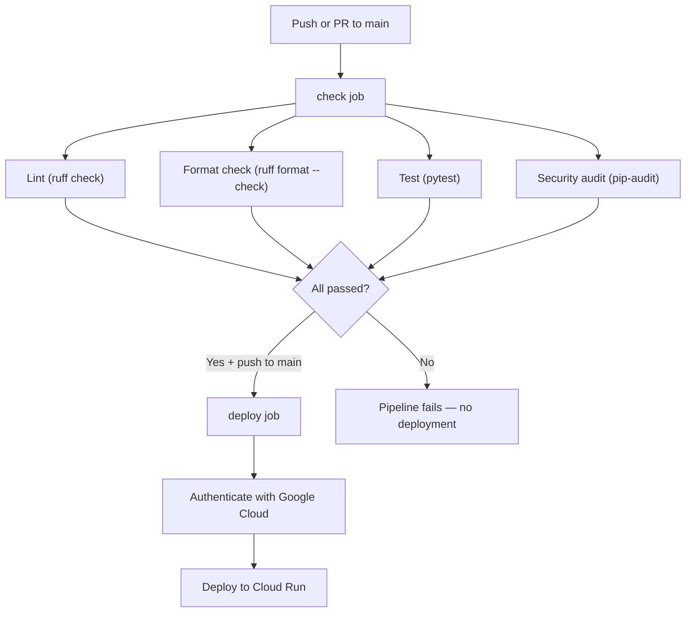

# CI/CD Pipeline — nikkoe-backend

This document explains every part of the CI/CD pipeline defined in `ci.yml`, why each step exists, and how the pieces fit together.

---

## What Is CI/CD?

**CI (Continuous Integration)** automatically checks every code change for problems — lint errors, test failures, security vulnerabilities — before it can reach production. **CD (Continuous Deployment)** automatically ships verified code to the live environment so users get updates without any manual work.

Together, they form an automated quality gate and delivery system: code that doesn't pass all checks never gets deployed.

---

## When Does the Pipeline Run?

```yaml
on:
  push:
    branches: [main]
  pull_request:
    branches: [main]
```

The pipeline triggers on:

- **Every push to `main`** — runs the full pipeline including deployment.
- **Every pull request targeting `main`** — runs the quality checks only (no deployment). This gives reviewers a green/red signal on the PR before merging.

---

## Concurrency Controls

```yaml
concurrency:
  group: ${{ github.workflow }}-${{ github.ref }}
  cancel-in-progress: true
```

**Why:** If you push two commits in quick succession, two pipeline runs start. The first one is immediately obsolete. Without concurrency controls, both run to completion — wasting CI minutes and potentially triggering two overlapping deployments.

This configuration groups runs by workflow name + branch. If a new run starts while an older one is still going, the older one is automatically cancelled.

---

## Pipeline Flow



---

## Job 1: `check` — Quality Gate

This job installs everything and runs four checks sequentially. All four must pass for the job to succeed.

### Step: Checkout

```yaml
- uses: actions/checkout@v4
```

The CI runner is a fresh Ubuntu virtual machine with nothing on it. This step downloads your repository code onto that machine so subsequent steps can work with it.

### Step: Set Up Python

```yaml
- uses: actions/setup-python@v5
  with:
    python-version: "3.12"
    cache: pip
```

Installs Python 3.12 (matching the version in `pyproject.toml` and `Dockerfile`) and enables pip caching. Caching means downloaded packages are saved between runs, so the next pipeline run doesn't re-download everything from scratch — saving 10-30 seconds.

### Step: Install Dependencies

```yaml
- run: pip install -r requirements.txt -r requirements-dev.txt
```

Installs both production dependencies (FastAPI, Pydantic, Supabase, etc.) and development tools (Ruff, pytest, httpx, pip-audit) in a single step.

**Why `requirements-dev.txt` exists separately:** Dev tools are pinned to exact versions (e.g. `ruff==0.15.9`) so that a new release of Ruff or pytest can't introduce new rules or breaking changes that randomly fail the pipeline on an unrelated commit. Pinning makes builds deterministic — the same code always gets the same result.

**Why dev tools aren't in `requirements.txt`:** Production dependencies and dev tools have different lifecycles. The Dockerfile and Cloud Run only need production deps. Keeping them separate avoids shipping unnecessary tools to production.

### Step: Lint

```yaml
- name: Lint
  run: ruff check app/
```

Runs [Ruff](https://docs.astral.sh/ruff/), a fast Python linter, against the `app/` directory. The rules are configured in `pyproject.toml`:

- **E** — pycodestyle errors (style issues like trailing whitespace, incorrect indentation)
- **F** — pyflakes (logic errors like unused imports, undefined names)
- **I** — isort (import ordering)

**Why:** Linting catches entire categories of bugs (undefined variables, unused imports that bloat the bundle, inconsistent style) without running the code. It's the cheapest and fastest check — if the code has basic syntax/style problems, there's no point running the slower test suite.

### Step: Format Check

```yaml
- name: Format check
  run: ruff format --check app/
```

Verifies that all code is formatted according to Ruff's formatter (similar to Black). The `--check` flag means it doesn't change anything — it just fails if any file would need reformatting.

**Why:** Consistent formatting eliminates noisy diffs in pull requests. Without it, one developer uses 2-space indentation, another uses 4, and every PR contains irrelevant whitespace changes mixed in with real logic changes. This makes code review slower and error-prone. By enforcing format in CI, the team stays consistent automatically.

### Step: Test

```yaml
- name: Test
  run: pytest --tb=short -q
```

Runs the test suite using pytest. The flags:

- `--tb=short` — shows a condensed traceback on failure (easier to read in CI logs)
- `-q` — quiet output (less noise, just pass/fail)

**Why:** Tests verify that the application actually works. Linting checks syntax; tests check behavior. The health check test (`tests/test_health.py`) validates that the FastAPI app can start up and respond correctly. As the application grows, tests should cover each endpoint, service, and edge case. Without tests, you only discover bugs when users report them.

### Step: Security Audit

```yaml
- name: Security audit
  run: pip-audit -r requirements.txt
```

Runs [pip-audit](https://github.com/pypa/pip-audit) against the production dependencies. It checks every package (and its transitive dependencies) against the [OSV vulnerability database](https://osv.dev/) for known security issues (CVEs).

**Why:** This backend handles authentication, financial data (sales, receipts, inventory), and connects to Supabase with a service role key. A known vulnerability in FastAPI, Pydantic, uvicorn, or the Supabase client could be exploited. pip-audit catches these automatically — a 5-second check that could prevent a security incident.

---

## Job 2: `deploy` — Continuous Deployment

```yaml
deploy:
  needs: check
  if: github.ref == 'refs/heads/main' && github.event_name == 'push'
```

**`needs: check`** — The deploy job only starts after the `check` job succeeds. If any check fails, deployment is blocked entirely. This is the core safety guarantee: broken code never reaches production.

**`if` condition** — Deployment only happens on pushes to `main`, not on pull requests. PRs run the checks to give feedback, but deploying a PR before it's reviewed and merged would be dangerous.

### Step: Authenticate with Google Cloud

```yaml
- id: auth
  uses: google-github-actions/auth@v2
  with:
    workload_identity_provider: projects/.../github-provider
    service_account: nikkoe-ci-deployer@...iam.gserviceaccount.com
```

Authenticates with Google Cloud using **Workload Identity Federation (WIF)**. This is the most secure authentication method — no long-lived service account keys are stored in GitHub secrets. Instead, GitHub's OIDC token is exchanged for a short-lived Google Cloud credential at runtime.

**Why WIF instead of a JSON key:** A leaked service account key gives permanent access to your GCP project. WIF tokens expire in minutes and are scoped to specific GitHub repos/branches, so even if somehow intercepted, the blast radius is minimal.

### Step: Deploy to Cloud Run

```yaml
- name: Deploy to Cloud Run
  run: |
    gcloud run deploy nikkoe-backend \
      --source . \
      --region us-central1 \
      --quiet
```

Deploys the application to **Google Cloud Run** using source-based deployment (`--source .`). Cloud Run builds a container image from the `Dockerfile` in the repo, pushes it to Artifact Registry, and deploys a new revision.

- `--region us-central1` — the deployment region
- `--quiet` — suppresses interactive prompts (essential in CI where there's no human to type "yes")

**Why Cloud Run:** It provides serverless container hosting — it scales to zero when there's no traffic (saving money) and auto-scales up under load. The `Dockerfile` is already in the repo, so Cloud Run can build and deploy in a single command.

---

## How to Modify This Pipeline

### Adding a new check
Add a new step inside the `check` job, after the dependency install step. The step should fail (exit code non-zero) when something is wrong. Example:

```yaml
- name: My new check
  run: some-tool --check
```

### Adding a new dev tool
1. Add it to `requirements-dev.txt` with a pinned version (e.g. `mypy==1.10.0`)
2. Add a corresponding step in the `check` job
3. No changes needed to `requirements.txt` or the `Dockerfile`

### Updating tool versions
Edit the version in `requirements-dev.txt`. Run the tool locally first to verify nothing breaks, then push.

---

## Files Involved

| File | Purpose |
|------|---------|
| `.github/workflows/ci.yml` | The pipeline definition (this document explains it) |
| `requirements.txt` | Production dependencies |
| `requirements-dev.txt` | Dev/CI tool versions (pinned) |
| `pyproject.toml` | Ruff and pytest configuration |
| `Dockerfile` | Container image definition used by Cloud Run |
| `tests/` | Test suite run by pytest |
