# Platform Data Flow Diagrams

Every user input in the Nikkoe platform, mapped to its communication path and the database tables it affects.

## Communication Patterns

There are two communication patterns in the platform:

1. **Frontend to Backend API to Supabase Auth** -- Login, Signup, Change Password
2. **Frontend to Backend API to Database** -- All CRUD operations (sales, receipts, items, etc.) and user creation

The frontend never communicates directly with Supabase Auth or the database. All operations go through the backend.

---

## Master Overview

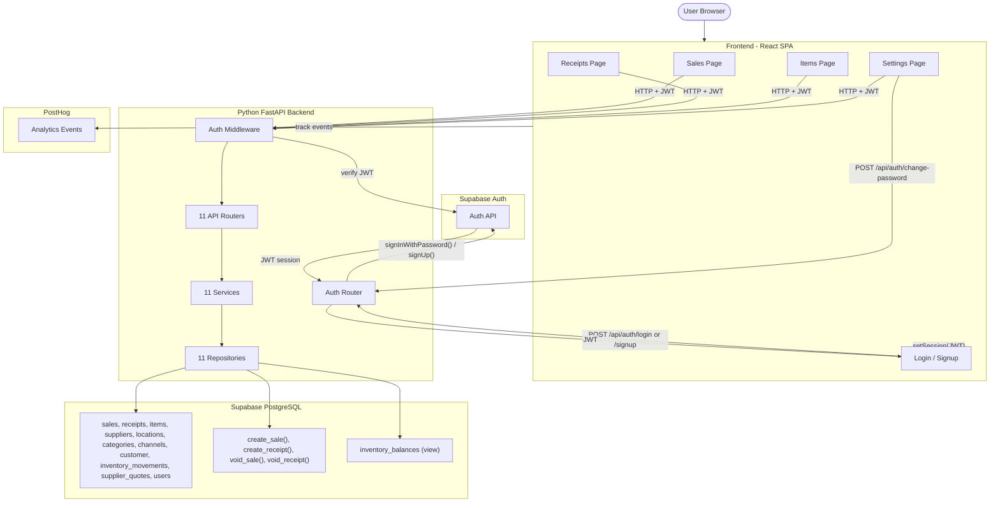

---

## Authentication

### Login

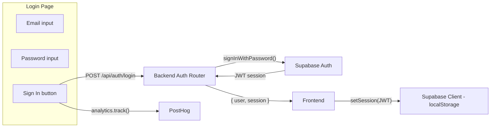

### Signup

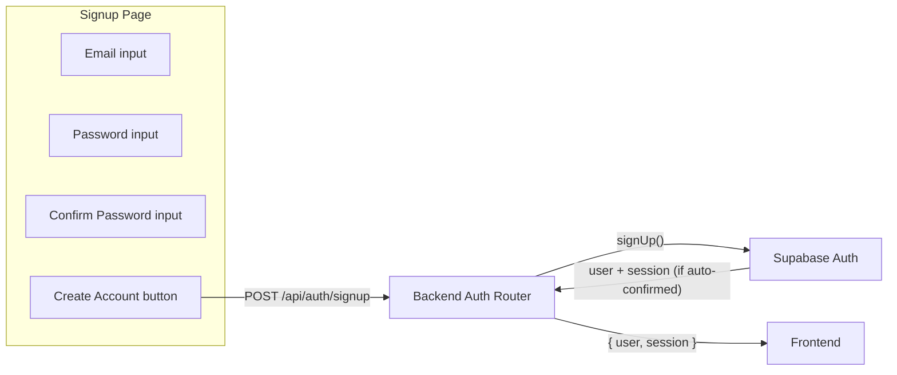

### Change Password

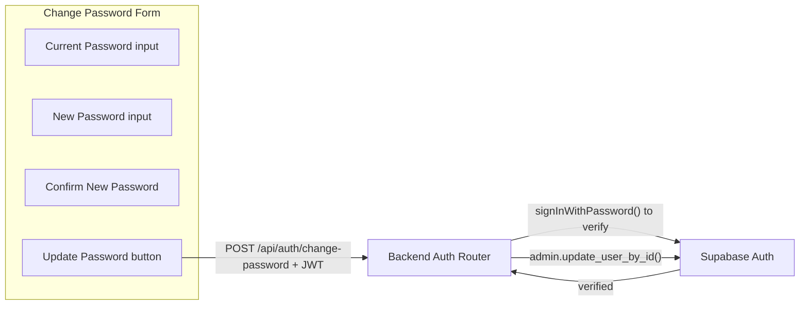

### Sign Out

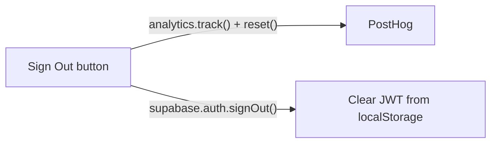

Sign out is the only auth action that stays in the frontend -- it just clears the locally stored JWT. No credentials are involved.

---

## Sales

### Add Sale Form

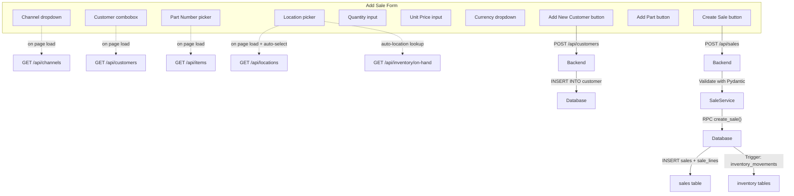

### Void Sale

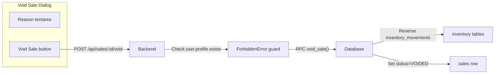

---

## Receipts

### Add Receipt Form

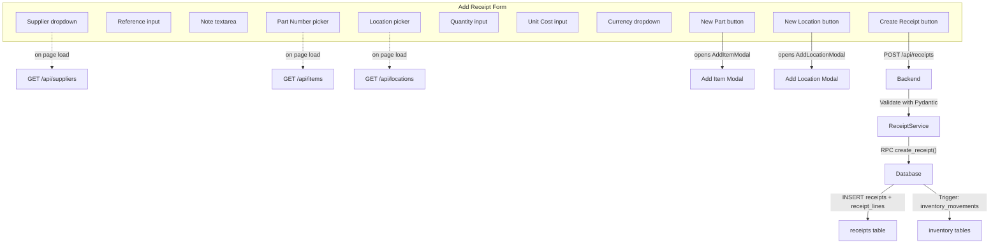

### Void Receipt

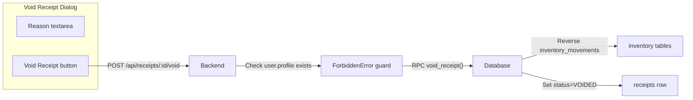

---

## Items

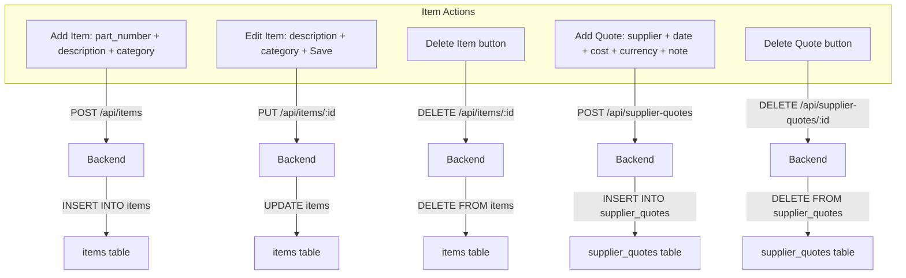

---

## Settings: Reference Data

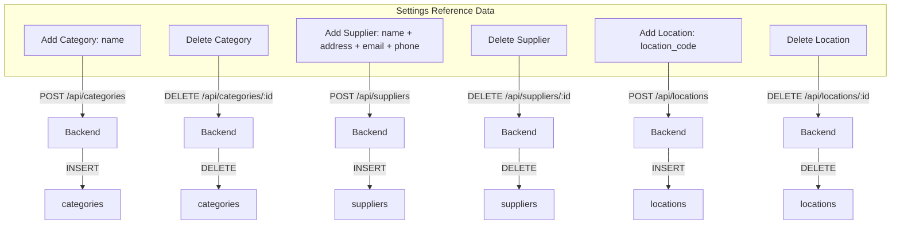

---

## Settings: Add User

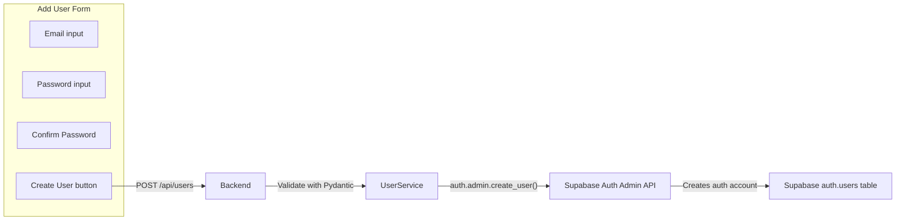

---

## Page Loads (auto-fetched, no user input)

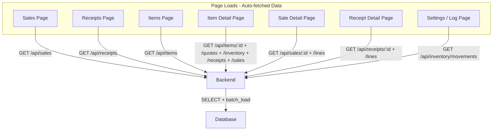

---

## Summary: Every User Input

| Page | User Input | Communication Path | Database Table Affected |
|------|-----------|-------------------|----------------------|
| Login | Email + Password + Submit | Frontend -> Backend -> Supabase Auth | auth.users (read) |
| Signup | Email + Password + Submit | Frontend -> Backend -> Supabase Auth | auth.users (insert) |
| Nav bar | Sign Out button | Frontend only (clear localStorage) | none |
| Sales | Channel dropdown (read) | Frontend -> Backend -> channels | none (read) |
| Sales | Customer combobox (read) | Frontend -> Backend -> customer | none (read) |
| Sales | Add New Customer button | Frontend -> Backend -> customer | customer (insert) |
| Sales | Part Number picker (read) | Frontend -> Backend -> items | none (read) |
| Sales | Location picker (read) | Frontend -> Backend -> locations | none (read) |
| Sales | Quantity + Price + Currency | Frontend only (local state) | none |
| Sales | Create Sale button | Frontend -> Backend -> RPC | sales + sale_lines + inventory_movements |
| Sale Detail | Void Reason + Void button | Frontend -> Backend -> RPC | sales + inventory_movements |
| Receipts | Supplier dropdown (read) | Frontend -> Backend -> suppliers | none (read) |
| Receipts | Reference + Note | Frontend only (local state) | none |
| Receipts | Part/Location/Qty/Cost/Currency | Frontend only (local state) | none |
| Receipts | Create Receipt button | Frontend -> Backend -> RPC | receipts + receipt_lines + inventory_movements |
| Receipts | New Part button | Opens modal -> Frontend -> Backend | items (insert) |
| Receipts | New Location button | Opens modal -> Frontend -> Backend | locations (insert) |
| Receipt Detail | Void Reason + Void button | Frontend -> Backend -> RPC | receipts + inventory_movements |
| Items | Add Item (part + desc + cat) | Frontend -> Backend | items (insert) |
| Item Detail | Edit description + category | Frontend -> Backend | items (update) |
| Item Detail | Delete Item button | Frontend -> Backend | items (delete) |
| Item Detail | Add Quote (supplier + cost + ...) | Frontend -> Backend | supplier_quotes (insert) |
| Item Detail | Delete Quote button | Frontend -> Backend | supplier_quotes (delete) |
| Settings | Add Category (name) | Frontend -> Backend | categories (insert) |
| Settings | Delete Category | Frontend -> Backend | categories (delete) |
| Settings | Add Supplier (name + ...) | Frontend -> Backend | suppliers (insert) |
| Settings | Delete Supplier | Frontend -> Backend | suppliers (delete) |
| Settings | Add Location (code) | Frontend -> Backend | locations (insert) |
| Settings | Delete Location | Frontend -> Backend | locations (delete) |
| Settings | Change Password (cur + new) | Frontend -> Backend -> Supabase Auth | auth.users (update) |
| Settings | Add User (email + pw) | Frontend -> Backend -> Supabase Auth Admin | auth.users (insert) |
